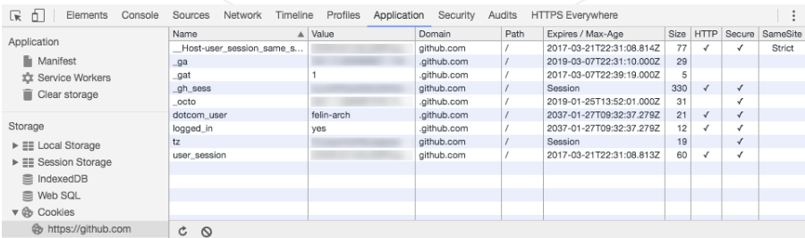
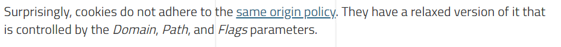
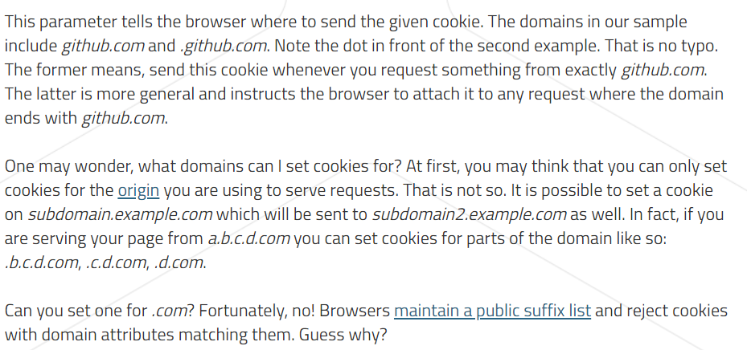
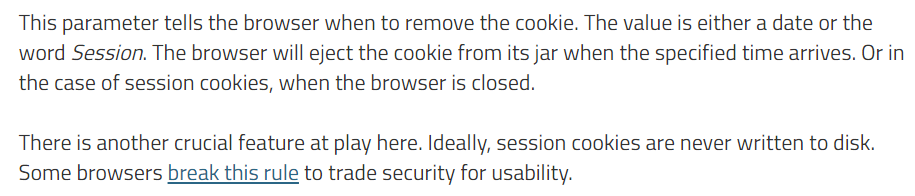
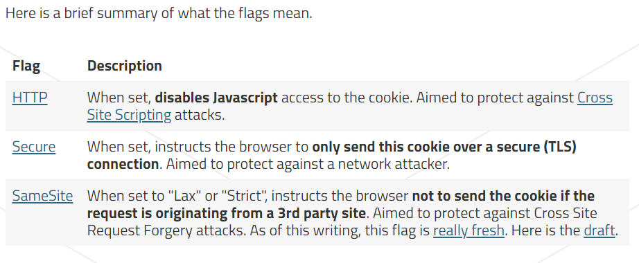
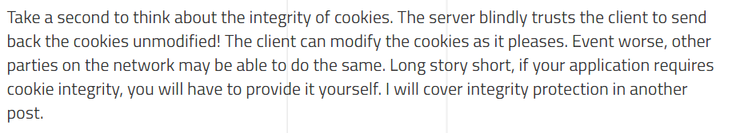

## Fundamentals

Cookies are essentially **key-value** pairs attached to HTTP requests and responses in the form of headers.

The server sends cookies to the client using the Set-Cookie header. In return, the browser sends these back with every subsequent request using the Cookie header.

Cookies are managed by the browser and not the web application running in the browser

## Analyzing cookies

### Scoping

### Domain

### Path

### Expiration

### Flags

### Cookie integrity

